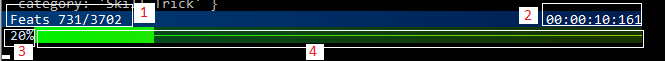

# y-log-bar
A nodejs console progress bar for heavy scripts.

Useful to monitor long time scripts.


<hr/>

#### Install :

```
npm install y-log-bar
```

#### Import :

```javascript
const logbar	= require('y-log-bar').get();
```

<hr/>

## <a name="_use"></a> Use

The progress bar will stays at the bottom of your terminal as long as you use **logbar.log** instead of **console.log**.
```javascript
logbar.show();
logbar.log('data=',data);
// instead of : console.log('data=',data);
```
Show in terminal.
```javascript
logbar.show();
```
Remove from terminal.
```javascript
logbar.hide();
```


The bar display will update every time you use **logbar.show** or **logbar.log** when visible.

<hr/>

## <a name="tg_menu"></a> Menu

+ [Use](#_use)
+ [Areas](#_areas)
+ [Change Values](#_change)
	+ [title](#_change_title)
	+ [percent](#_change_percent)
	+ [time](#_change_time)
+ [Look and feel](#_lkfeel)
	+ [title](#_lkfeel_title)
	+ [percent value](#_lkfeel_percval)
	+ [progress bar](#_lkfeel_percbar)

<hr/>

## <a name="_areas"></a> Areas

+ 1 : **title**
+ 2 : **time**
+ 3 : **percent value**
+ 4 : **percent bar**

<hr/>

### <a name="_change"></a> Change Values

+ #### <a name="_change_title"></a>title.
	Area 1.
	```javascript
	// must be a string
	logbar.title.value=' some text';
	```

+ #### <a name="_change_percent"></a>percent.
	Area 3 and 4.
	```javascript
	// must be a number between 0 and 1
	logbar.perc.value=0.7;
	```

+ #### <a name="_change_time"></a>time.
	Area 2. Show elapsed time.
	```javascript
	// default = false
	logbar.time.visible=true;
	```
	Reset elapsed time.
	```javascript
	logbar.time.start=0;
	```

<hr/>

### <a name="_lkfeel"></a> Look and feel.

Customise logbar display. NB: All colors must be a rgb value.

+ #### <a name="_lkfeel_title"></a> title bar.
	Area 1 and 2.
	+ front colors (gradient)
	```javascript
	logbar.title.front.from=[255,0,0]; //from left
	logbar.title.front.to=[255,255,0]; //to right
	```
	+ back colors (gradient)
	```javascript
	logbar.title.back.from=[0,100,200]; //from left
	logbar.title.back.to=[0,50,100]; //to right
	```
	+ character for for unused space
	```javascript
	// default = ' '
	logbar.title.fill="=";
	```


+ #### <a name="_lkfeel_percval"></a> percent value.
	Area 3.
	+ front color
	```javascript
	logbar.perc.front=[255,0,0];
	```
	+ back color
	```javascript
	logbar.perc.back=[0,200,150];
	```

+ #### <a name="_lkfeel_percbar"></a> percent bar.
	Area 4.
	+ front colors (gradient)
	```javascript
	logbar.bar.front.from=[255,0,0]; //from left
	logbar.bar.front.to=[255,255,0]; //to right
	```
	+ back colors (gradient)
	```javascript
	logbar.bar.back.from=[0,100,200]; //from left
	logbar.bar.back.to=[0,50,100]; //to right
	```
	+ character for filled bar
	```javascript
	logbar.bar.chIn='X';
	```
	+ character for empty bar
	```javascript
	logbar.bar.chOut='-';
	```

See **[exemple.js](exemples/exemple.js)**.
